<p align='center'>
    <br/><br/>
</p>
<p align='center '>
    <h1>CEFOCA</h1>
</p>

# Summary

* [Prerequisites](#prerequisites)
* [Running-the-Front-End](#running-the-front-end)
* [Technologies](#technologies)


<p style='text-align:center '>
    <h2>This is a registration project for a training center  </h2> 
    <h2>A complete system: front-end, back-end and database </h2> 
</p>

<p style='text-align:center '>
    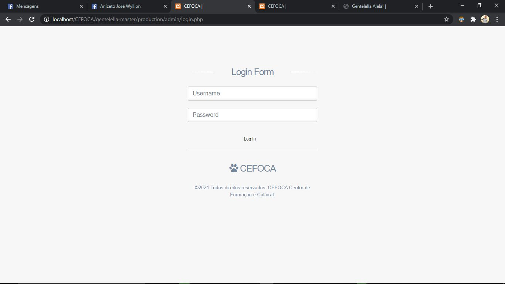
    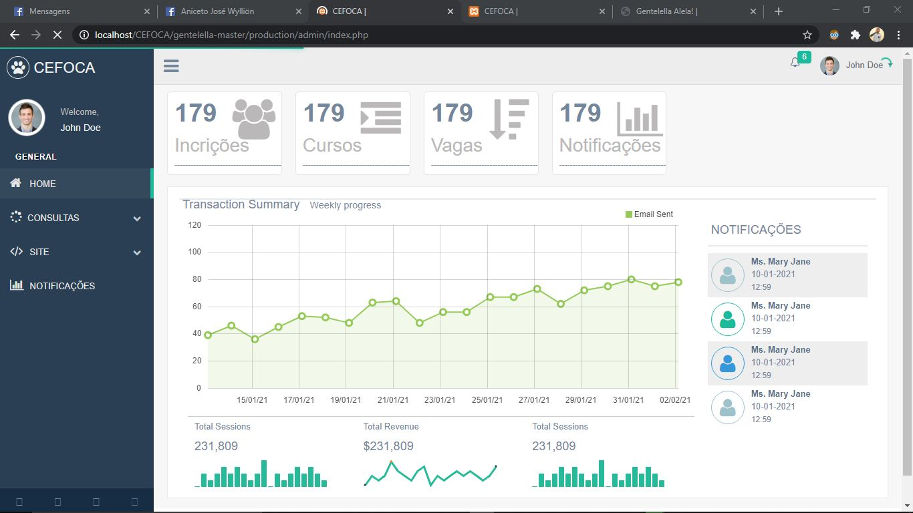
    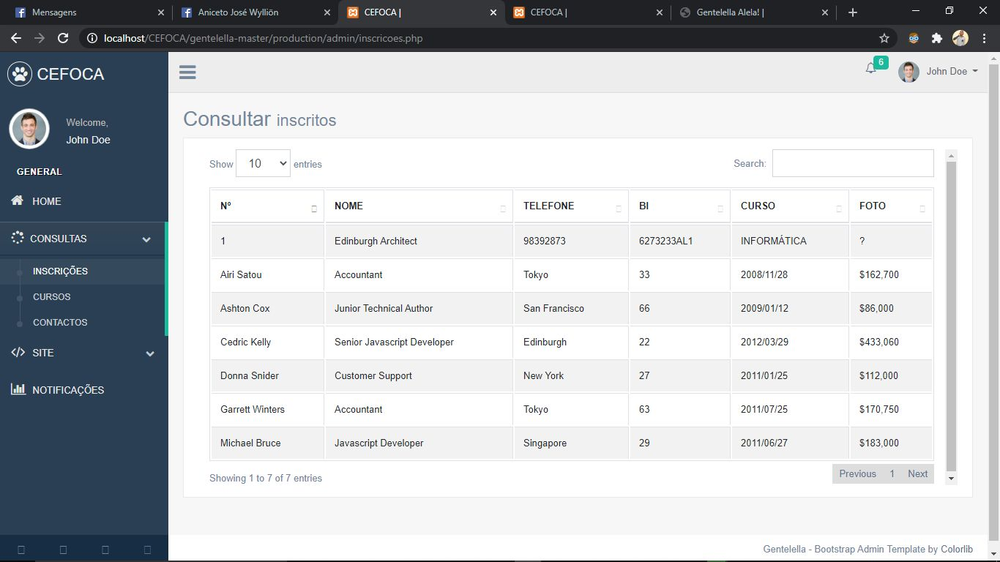
    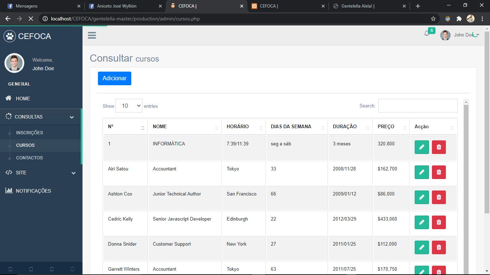
    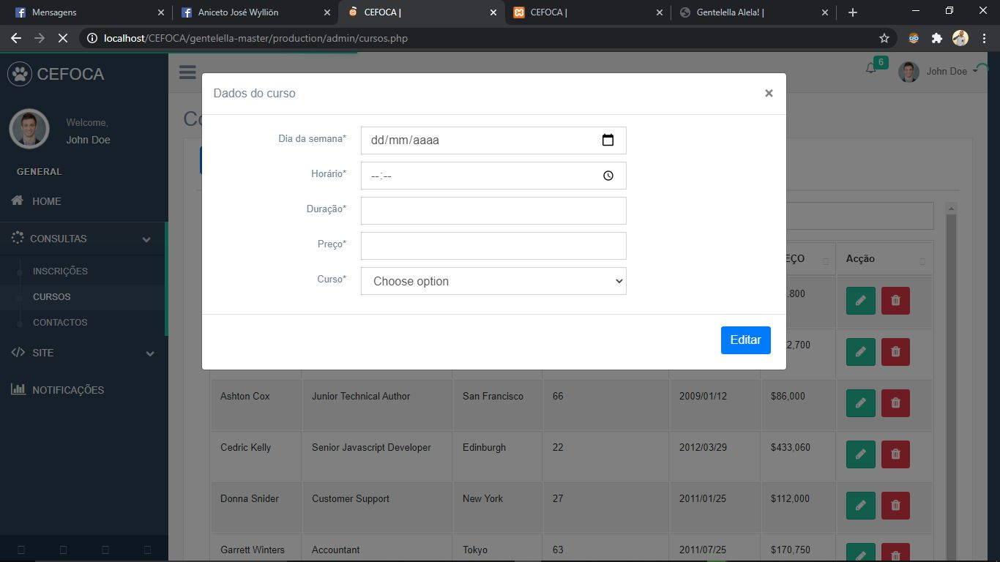
    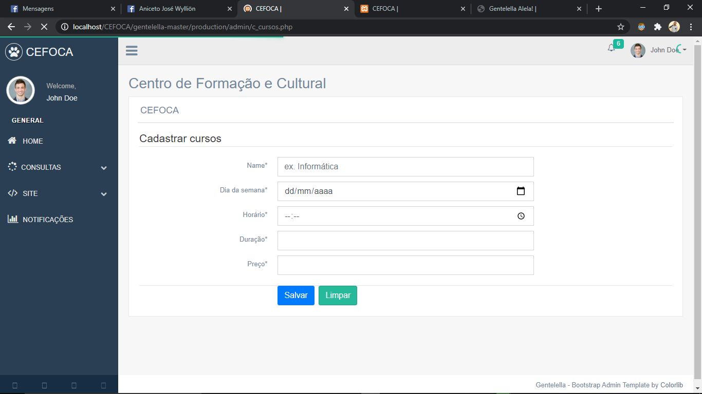
    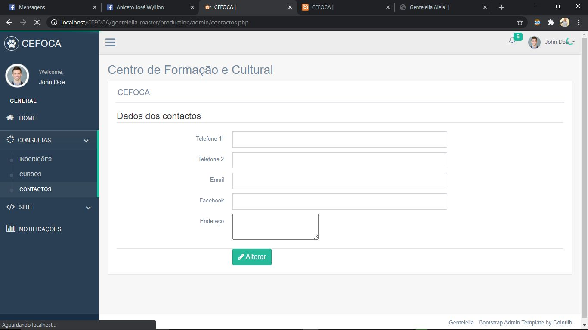
    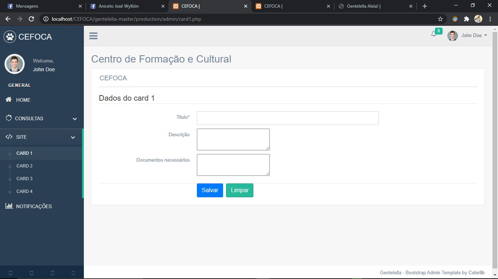
    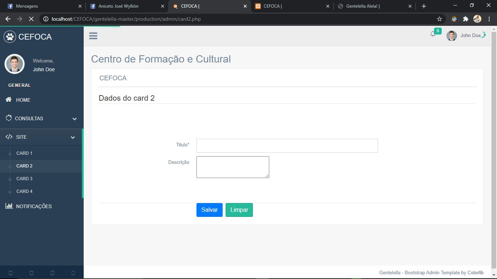
    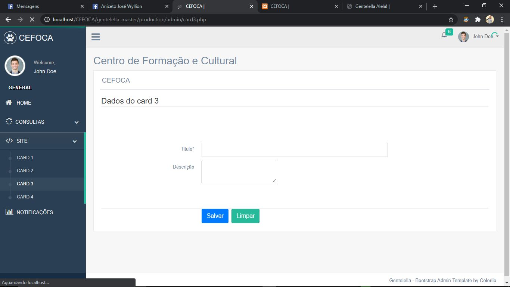
    
    
    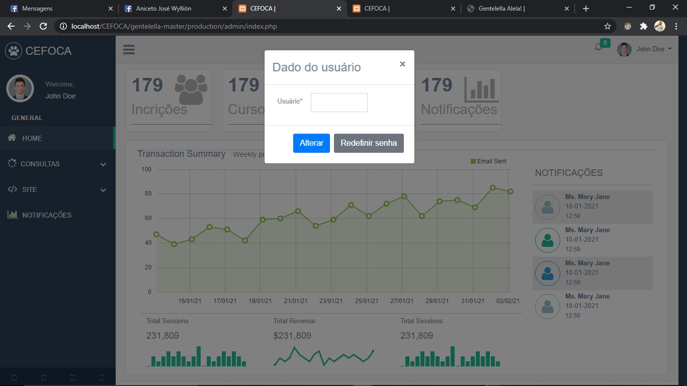
    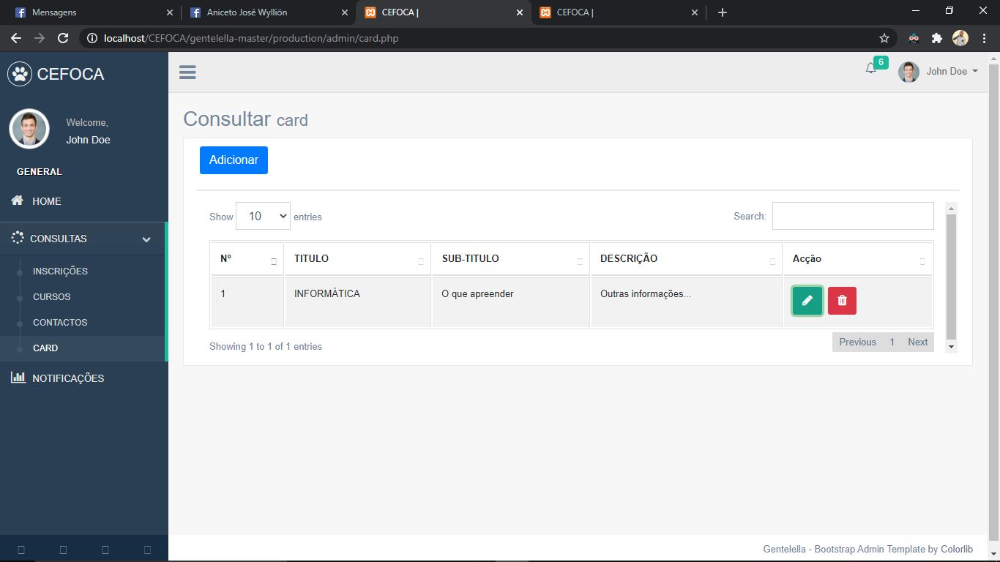
    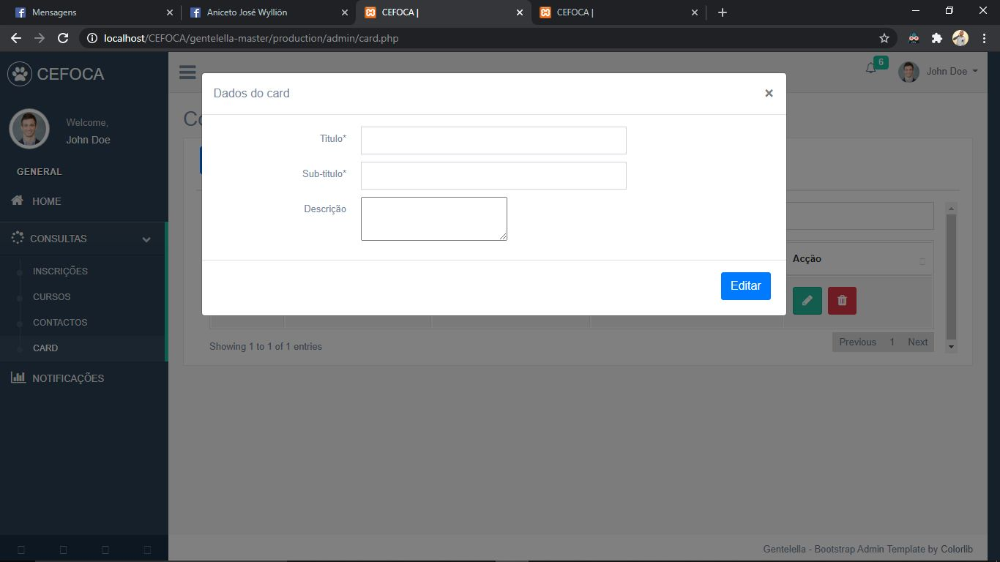
    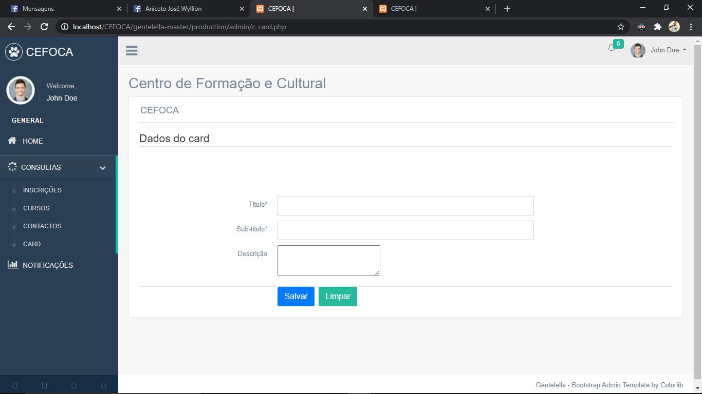
    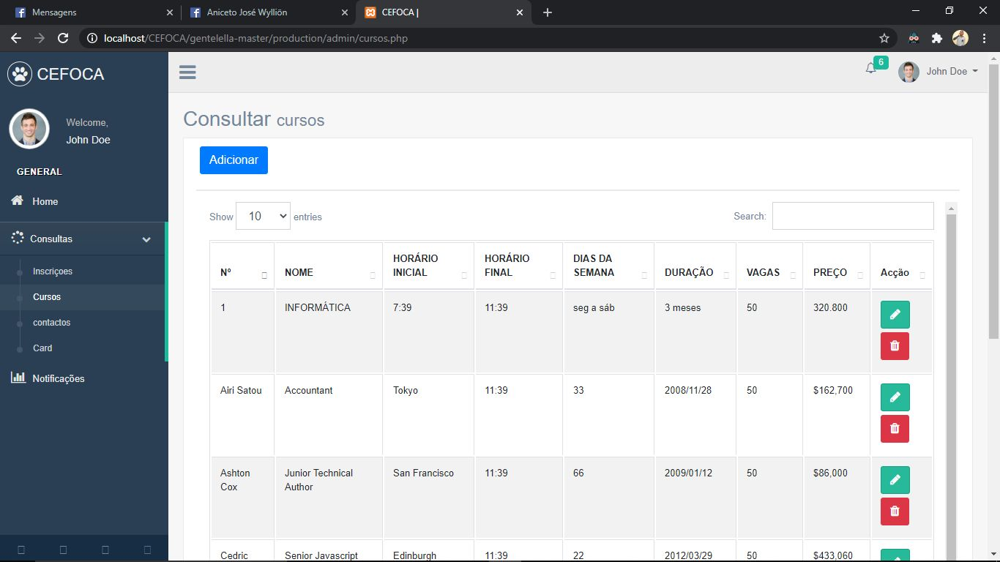
</p>


## prerequisites

To run the project on your machine you will need to install the following tools:</br>
[Git](https://git-scm.com), [Netbens](https://netbeans.apache.org/kb/), [Xamp](https://www.apachefriends.org/pt_br/download.html) or [Wamp](https://www.wampserver.com/).</br>


## Running-the-Front-End

```bash
# Clone this repository
$ git clone https://github.com/aniceto-jolela/CEFOCA.git

# Access the project folder in terminal/cmd
$ cd CEFOCA

# Import database in phpMyAdmin
$ cd/xamp/hdocs/CEFOCA/bd/cefoca.sql

#  User    |  Password
$ admin    |   1234

```
### Technologies

The following tools were used in the construction of the project:

- [JavaScript](https://developer.mozilla.org/pt-BR/docs/Web/JavaScript)
- [PHP](https://www.php.net/docs.php)
- [MySQL](https://www.mysql.com/)
- [HTML](https://developer.mozilla.org/pt-BR/docs/Web/HTML)
- [CSS](https://developer.mozilla.org/pt-BR/docs/Web/CSS)
- [jQuery](https://api.jquery.com/)
- [BootStrap](https://getbootstrap.com/docs/4.1/getting-started/introduction/)
- [Ajax](https://developer.mozilla.org/pt-BR/docs/Web/Guide/AJAX)
- [Json](https://www.json.org/json-en.html)
- [Less](https://lesscss.org/)
- [Scss](https://sass-lang.com/)
- [Chart](https://www.chartjs.org/docs/)
- [Validator](https://blockdaemon.com/products/white-label-validator/?utm_source=google&utm_medium=cpc&utm_campaign=ETH_2_Reboot1_Validator&gclid=Cj0KCQiA99ybBhD9ARIsALvZavWtiiyRfxaiU6MA0akV3YVBjsYkK4hlRQvqFcOm6goPRSRmLDRwRjEaAimwEALw_wcB)
- [Dompdf](https://github.com/dompdf/dompdf)
- db2phpnb-1.107.nbm

###### Author : Aniceto Jolela 🥰
- [Linkedin](https://www.linkedin.com/in/aniceto-jolela-076547184/)
